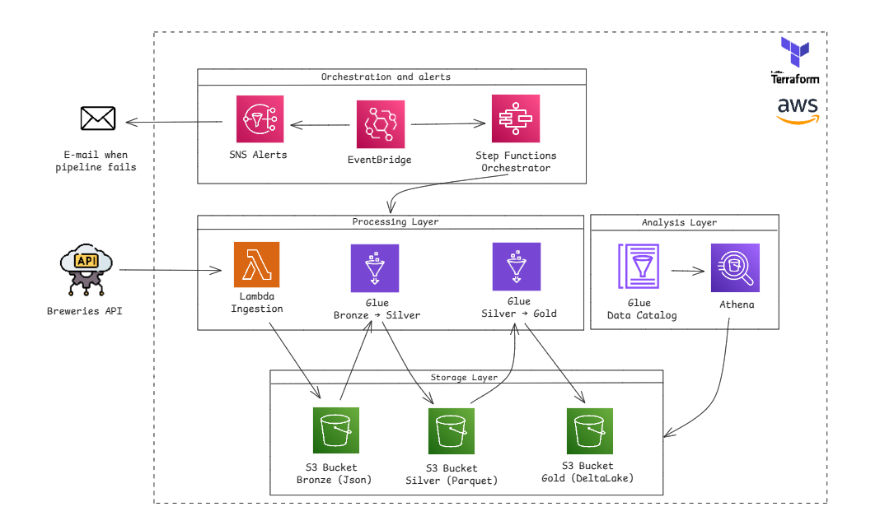

# Bees Breweries Lakehouse (AWS)

A fully-infra-as-code demo of a small **data lakehouse** on AWS that ingests brewery data and builds curated analytical layers. The project uses **S3 (Bronze/Silver/Gold)**, **AWS Glue (ETL + Delta Lake write for Gold)**, **Step Functions** (orchestration), **EventBridge + SNS** (alerts), and **Athena + Glue Data Catalog** (SQL access). Everything is provisioned with **Terraform** following a modular layout.

---

## What you get

- **Ingestion (Bronze)** — Lambda writes raw JSON to S3 by `run_date=YYYY-MM-DD/page=*`.
- **Refine (Silver)** — Glue Job normalizes/cleans JSON to **Parquet** partitioned by `ingestion_date`, `country`, `state`.
- **Aggregate (Gold)** — Glue Job aggregates counts by `(country, state, brewery_type)` and writes **Delta Lake** once per `ingestion_date`, also partitioned by `ingestion_date`, `country`, `state`.
- **Orchestration** — Step Functions runs `Lambda -> Glue Silver -> Glue Gold` (with sensible retry & backoff).
- **Monitoring & Alerts** — EventBridge rules detect **FAILED/TIMED_OUT** for Glue and Step Functions and publish clean, short messages to an **SNS topic**.
- **Query** — Athena workgroup and Glue catalog tables let you query Silver (Parquet) and Gold (Delta) with SQL.
- **(Optional)** Partition metadata upkeep via **Glue Crawler** (or `MSCK REPAIR` if you prefer).

---

## Architecture (high-level)





---

## Repository layout (simplified)

```
aws/
  us-east-1/
    infrastructure/
      main.tf, variables.tf, outputs.tf, dev.tfvars (yours)
      step_functions.tf
      event_bridge.tf
      event_alerts.tf
      sns.tf
      athena.tf
      glue_catalog/
        databases.tf
        tables.tf   (Parquet + Delta definitions with partition projection/Delta config)
    modules/
      s3/
      glue_job/
      glue_catalog_database/
      glue_catalog_table/        (single module supports parquet or delta via var.format)
      sfn_state_machine/
      lambda_function/           (ingestion)
      glue_crawler/              (optional)
scripts/
  glue/
    bronze_to_silver.py
    silver_to_gold_delta.py
```

> Your local structure may differ a little; use this as a guide.

---

## Prerequisites

- **AWS account** with permissions for S3, Lambda, Glue, Step Functions, EventBridge, SNS, Athena/Glue Data Catalog, CloudWatch.
- **AWS CLI** configured (`aws configure`) with a profile/role that can provision these services.
- **Terraform** v1.5+.
- A **region** (examples use `us-east-1`).

---

## Quick start

1) **Clone & enter**

```bash
git clone <your-repo-url> bees-breweries-aws
cd bees-breweries-aws/aws/us-east-1/infrastructure
```

2) **Create your `dev.tfvars`** (example)

```hcl
environment         = "dev"

# Buckets (names should already be globally unique/consistent with your account policy)
bees_s3_bronze      = "bees-lakehouse-bronze"
bees_s3_silver      = "bees-lakehouse-silver"
bees_s3_gold        = "bees-lakehouse-gold"
bees_s3_logs        = "bees-lakehouse-logs"
bees_s3_scripts     = "bees-lakehouse-scripts"

# Glue jobs logical names
glue_job_bronze_name = "openbrewerydb-bronze-to-silver"
glue_job_gold_name   = "openbrewerydb-silver-to-gold"

# Step Functions
sfn_name = "breweries-pipeline"

# Athena
athena_workgroup_name = "breweries-athena-wg"

# Dataset
dataset_name = "openbrewerydb"
```

3) **Init/Plan/Apply**

```bash
terraform init
terraform plan  -var-file=dev.tfvars
terraform apply -var-file=dev.tfvars -auto-approve
```

> The apply will: create buckets (if in scope), IAM roles/policies for Glue/Step Functions/EventBridge, Lambda (ingestion), Glue Jobs (Bronze->Silver, Silver->Gold), Step Functions state machine, SNS + subscription (confirm the email!), Athena workgroup + Glue Databases/Tables.

4) **Run the pipeline**

- In the AWS Console → **Step Functions** → state machine named like `breweries-pipeline-dev` → **Start execution** with empty input `{}`.
- Or via CLI (replace ARN):

```bash
aws stepfunctions start-execution --state-machine-arn arn:aws:states:us-east-1:<acct>:stateMachine:breweries-pipeline-dev
```

5) **Inspect S3**

- **Bronze**: `s3://bees-lakehouse-bronze-<env>/<dataset>/run_date=YYYY-MM-DD/page=*/breweries.json`
- **Silver**: `s3://bees-lakehouse-silver-<env>/<dataset>/ingestion_date=YYYY-MM-DD/country=.../state=.../*.parquet`
- **Gold (Delta)**: `s3://bees-lakehouse-gold-<env>/<dataset>/_delta_log/` and partition folders by date/country/state

6) **Query with Athena**

- Switch to workgroup `breweries-athena-wg` (Terraform configured it to write results to your **logs** bucket under `athena-results/`).
- Example queries:

```sql
-- Silver preview
SELECT * 
FROM db_silver.open_breweries
WHERE ingestion_date = '2025-08-16'
LIMIT 20;

-- Gold: total breweries by type in California (Delta)
SELECT brewery_type, SUM(breweries_count) AS total
FROM db_gold.open_breweries_agg
WHERE ingestion_date = '2025-08-16' AND country = 'United States' AND state = 'California'
GROUP BY brewery_type
ORDER BY total DESC;
```

> If you enabled the **Glue Crawler** for Gold, catalog updates are automatic. If not, and you use a non-projection table, run `MSCK REPAIR TABLE db_gold.open_breweries_agg` after new dates appear (we also showed how to add an optional MSCK step in Step Functions).

---

## Alerts

You’ll receive **one concise email per failed component** (Lambda/Glue/State Machine). We use EventBridge rules with **input transformers** to keep messages short, and we dedupe at source (no Glue “fan-out” on retries).

- To change recipients, edit the **SNS subscription** in `sns.tf`.
- To change the format, tweak `event_alerts.tf` input templates.

Example SNS message body (Glue job failure):

```
[ALERT] Glue job openbrewerydb-silver-to-gold is FAILED at 2025-08-16T02:34:56Z.
JobRunId: jr_1234567890
Account: 123456789012 | Region: us-east-1
```

---

## Notes & tips

- **Delta Lake on S3:** Glue writes the transactional `_delta_log` at the **dataset root**. Partitions (`ingestion_date/country/state`) are managed by Delta metadata; we still register a Glue table so Athena (with the Delta connector) can query it.
- **Partition Projection (Silver):** We use **projection** so Athena infers partitions without `MSCK`. Just filter by `ingestion_date`, `country`, `state` in SQL.
- **Retries:** Step Functions handles retry/backoff around Glue so you don’t get duplicate emails. Glue job retries can be 0.
- **Costs:** This stacks free-tier friendly components, but Athena/Glue/Step Functions/S3 have charges—keep an eye on your usage and consider turning off the crawler if not needed.

---

## Clean up

```bash
terraform destroy -var-file=dev.tfvars
```

If S3 buckets are **not empty**, `destroy` will fail. Empty them first (or set a bucket module flag to allow force-destroy if you included that option).

---

## FAQ

**Q: I get zero rows in Athena for Gold.**  
A: Ensure the date you’re querying exists in the Gold Delta dataset **and** your catalog is up to date. If not using crawler, run `MSCK REPAIR TABLE db_gold.open_breweries_agg;` or ensure the table definition matches the Delta location.

**Q: I received duplicate emails on failure.**  
A: We consolidated targets and de-duplicated by run. You should see only one SNS per failed Glue run or state machine execution. If you add new rules, keep the input transformer and filters aligned.

**Q: Can I add a BI dashboard?**  
A: Yes—QuickSight works great over Athena. In free-tier accounts, you may be limited; consider connecting Athena to local tools (JDBC/ODBC) or exporting aggregates to CSV/Parquet for a desktop BI tool.
